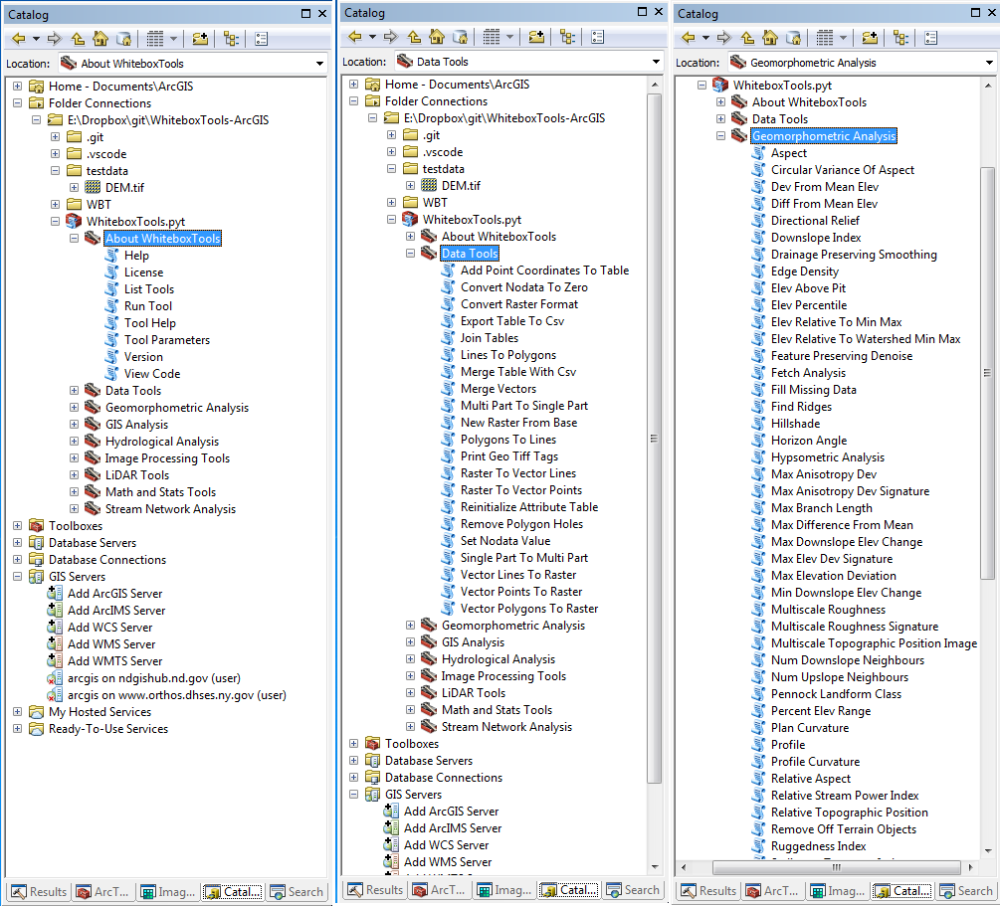

# WhiteboxTools-ArcGIS

ArcGIS Python Toolbox for WhiteboxTools.

This repository is related to the **ArcGIS Python Toolbox for WhiteboxTools**, which is an ArcGIS frontend of a stand-alone executable command-line program called **[WhiteboxTools](https://github.com/jblindsay/whitebox-tools)**.

* Authors: Dr. John Lindsay (<http://www.uoguelph.ca/~hydrogeo/index.html>)
* Contributors: Dr. Qiusheng Wu (<https://wetlands.io> | <https://LidarBlog.com>)
* WhiteboxTools: <https://github.com/jblindsay/whitebox-tools>
* User Manual: <https://jblindsay.github.io/wbt_book>
* WhiteboxTools-ArcGIS: <https://github.com/giswqs/WhiteboxTools-ArcGIS>
* WhiteboxTools-Python: <https://github.com/giswqs/whitebox>
* WhiteboxTools-R: <https://github.com/giswqs/whiteboxR>
* Free software: [MIT license](https://opensource.org/licenses/MIT)

**Contents**

1. [Description](#description)
2. [Installation](#installation)
3. [Usage](#usage)
4. [Available Tools](#available-tools)
5. [Supported Data Formats](#supported-data-formats)
6. [Contributing](#contributing)
7. [License](#license)
8. [Reporting Bugs](#reporting-bugs)
9. [Toolbox Screenshots](#toolbox-screenshots)

## Description

**WhiteboxTools-ArcGIS** is an ArcGIS Python Toolbox for **WhiteboxTools**, an advanced geospatial data analysis platform developed by Prof. John Lindsay ([webpage](https://www.uoguelph.ca/~hydrogeo/index.html); [jblindsay](https://github.com/jblindsay)) at the University of Guelph's [Geomorphometry and Hydrogeomatics Research Group](https://www.uoguelph.ca/~hydrogeo/index.html). *WhiteboxTools* can be used to perform common geographical information systems (GIS) analysis operations, such as cost-distance analysis, distance buffering, and raster reclassification. Remote sensing and image processing tasks include image enhancement (e.g. panchromatic sharpening, contrast adjustments), image mosaicing, numerous filtering operations, simple classification (k-means), and common image transformations. *WhiteboxTools* also contains advanced tooling for spatial hydrological analysis (e.g. flow-accumulation, watershed delineation, stream network analysis, sink removal), terrain analysis (e.g. common terrain indices such as slope, curvatures, wetness index, hillshading; hypsometric analysis; multi-scale topographic position analysis), and LiDAR data processing. LiDAR point clouds can be interrogated (LidarInfo, LidarHistogram), segmented, tiled and joined, analyized for outliers, interpolated to rasters (DEMs, intensity images), and ground-points can be classified or filtered. *WhiteboxTools* is not a cartographic or spatial data visualization package; instead it is meant to serve as an analytical backend for other data visualization software, mainly GIS. Suggested citation: Lindsay, J. B. (2016). Whitebox GAT: A case study in geomorphometric analysis. _Computers & Geosciences_, 95, 75-84. doi:[10.1016/j.cageo.2016.07.003](http://dx.doi.org/10.1016/j.cageo.2016.07.003).

## Installation

### Step 1: Download the toolbox

1. Click the green button (**[Clone or download](https://gishub.org/whitebox-arcgis-download)**) on the upper-right corner of this page to download the toolbox as a zip file.

    

2. Depcompress the downloaded zip file.

### Step 2: Connect to the toolbox

1. Navigate to the **Folder Connections** node in the catalog window tree.

2. Right-click the node and choose **Connect To Folder**.

    

3. Type the path or navigate to the **WhiteboxTools-ArcGIS** folder and click **OK**.

4. Browse into the toolbox and start using its tools.

    

## Usage

Open any tool within the toolbox and start using it. Check out the [WhiteboxTools User Mannual](https://jblindsay.github.io/wbt_book/) for more detailed help documentation of each tool.

## Available Tools

The **[WhiteboxTools](https://github.com/jblindsay/whitebox-tools)** library currently contains **400** tools, which are each grouped based on their main function into one of the following categories: Data Tools, GIS Analysis, Hydrological Analysis, Image Analysis, LiDAR Analysis, Mathematical and Statistical Analysis, Stream Network Analysis, and Terrain Analysis. For a listing of available tools, complete with documentation and usage details, please see the [WhiteboxTools User Manual](https://jblindsay.github.io/wbt_book/available_tools/index.html).

## Supported Data Formats

The **WhiteboxTools** library can currently support read/writing raster data in [*Whitebox GAT*](http://www.uoguelph.ca/~hydrogeo/Whitebox/), GeoTIFF, ESRI (ArcGIS) ASCII and binary (.flt & .hdr), GRASS GIS, Idrisi, SAGA GIS (binary and ASCII), and Surfer 7 data formats. The library is primarily tested using Whitebox raster data sets and if you encounter issues when reading/writing data in other formats, you should report the [issue](https://github.com/jblindsay/whitebox-tools/issues). Please note that there are no plans to incorporate third-party libraries, like [GDAL](http://www.gdal.org), in the project given the design goal of keeping a pure (or as close as possible) Rust codebase.

At present, there is limited ability in *WhiteboxTools* to read vector geospatial data. Support for Shapefile (and other common vector formats) will be enhanced within the library soon.

LiDAR data can be read/written in the common [LAS](https://www.asprs.org/committee-general/laser-las-file-format-exchange-activities.html) data format. *WhiteboxTools* can read and write LAS files that have been compressed (zipped with a .zip extension) using the common DEFLATE algorithm. Note that only LAS file should be contained within a zipped archive file. The compressed LiDAR format LAZ and ESRI LiDAR format are not currently supported by the library.

## Contributing

If you would like to contribute to the project as a developer, follow these instructions to get started:

1. Fork the WhiteboxTools-ArcGIS repository (<https://github.com/giswqs/WhiteboxTools-ArcGIS>)
2. Create your feature branch (git checkout -b my-new-feature)
3. Commit your changes (git commit -am 'Add some feature')
4. Push to the branch (git push origin my-new-feature)
5. Create a new Pull Request

Unless explicitly stated otherwise, any contribution intentionally submitted for inclusion in the work shall be licensed as the [MIT license](https://opensource.org/licenses/MIT) without any additional terms or conditions.

## License

The **ArcGIS Toolbox for WhiteboxTools** is distributed under the [MIT license](https://opensource.org/licenses/MIT), a permissive open-source (free software) license.

## Reporting Bugs

**ArcGIS Toolbox for WhiteboxTools** is distributed as is and without warranty of suitability for application. If you encounter flaws with the software (i.e. bugs) please report the issue. Providing a detailed description of the conditions under which the bug occurred will help to identify the bug. *Use the [Issues tracker](https://github.com/giswqs/WhiteboxTools-ArcGIS/issues) on GitHub to report issues with the software and to request feature enchancements.* Please do not email Dr. Qiusheng Wu or Dr. John Lindsay directly with bugs.

## Toolbox Screenshots

